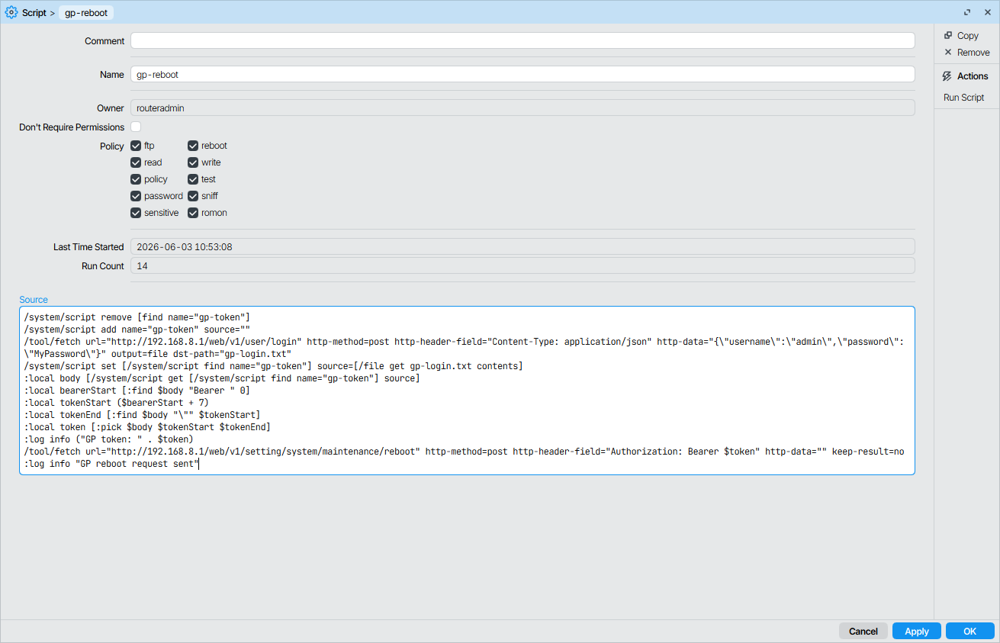
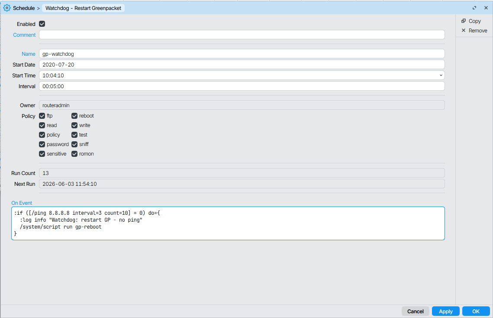

# Restart GreenPacket using MikroTik

**Tested with:**
- GreenPacket H5-200Q1, FV: 912.001.604.145
- MikroTik ROS v7.23

Change GreenPacket's **IP**, **username** and **password** in your script.
In this script are:  
**IP:** 192.168.8.1  
**Username:** admin  
**Password:** MyPassword  

This script will automatically create the file `gp-login.txt` and a temporary script `gp-token`. MikroTik has a lot of limits and I didn't find a better solution for it.

**How it works:**
1. Log in to GreenPacket router
2. Get token from response
3. Prepare temporary script with token data
4. Call reboot with token

**Installation:**  
Create a new script in your MikroTik with name `gp-reboot` and insert this code (in Winbox):

```bash
/system/script remove [find name="gp-token"]
/system/script add name="gp-token" source=""
/tool/fetch url="http://192.168.8.1/web/v1/user/login" http-method=post http-header-field="Content-Type: application/json" http-data="{\"username\":\"admin\",\"password\":\"MyPassword\"}" output=file dst-path="gp-login.txt"
/system/script set [/system/script find name="gp-token"] source=[/file get gp-login.txt contents]
:local body [/system/script get [/system/script find name="gp-token"] source]
:local bearerStart [:find $body "Bearer " 0]
:local tokenStart ($bearerStart + 7)
:local tokenEnd [:find $body "\"" $tokenStart]
:local token [:pick $body $tokenStart $tokenEnd]
:log info ("GP token: " . $token)
/tool/fetch url="http://192.168.8.1/web/v1/setting/system/maintenance/reboot" http-method=post http-header-field="Authorization: Bearer $token" http-data="" keep-result=no
:log info "GP reboot request sent"
```


  
  
  
  

**Another recommended script for watchdog**  
This script tests your internet connection and if it is lost, it will reboot the GreenPacket router.  
Create a new scheduled task (in Scheduler) with name `gp-watchdog` and insert this code (in Winbox):
```bash
:if ([/ping 8.8.8.8 interval=3 count=10] = 0) do={
  :log info "Watchdog: restart GP - no ping"
  /system/script run gp-reboot
}
```

Interval (every 5 minutes): 00:05:00


